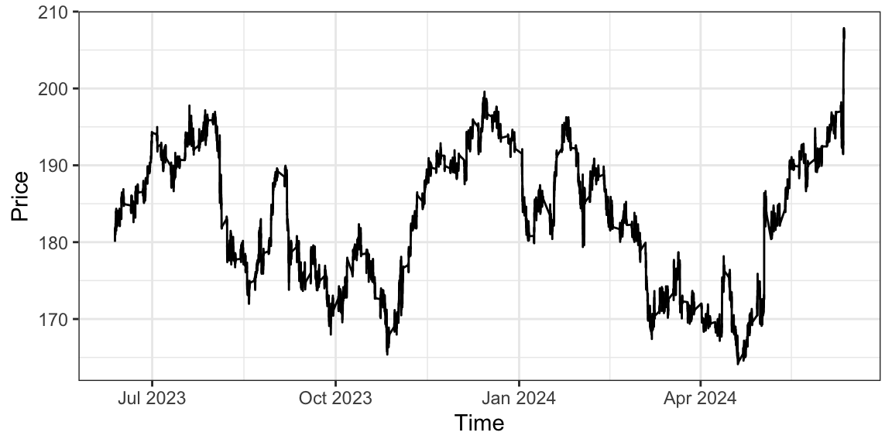
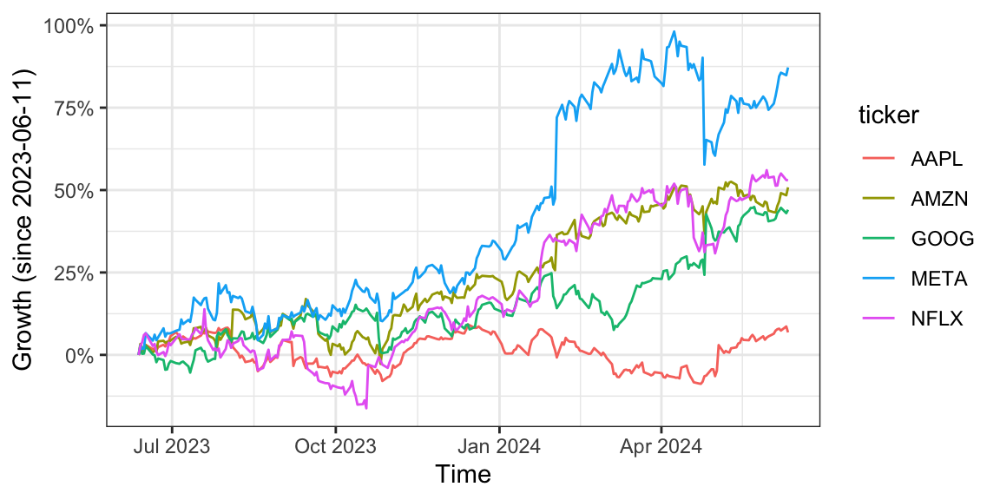
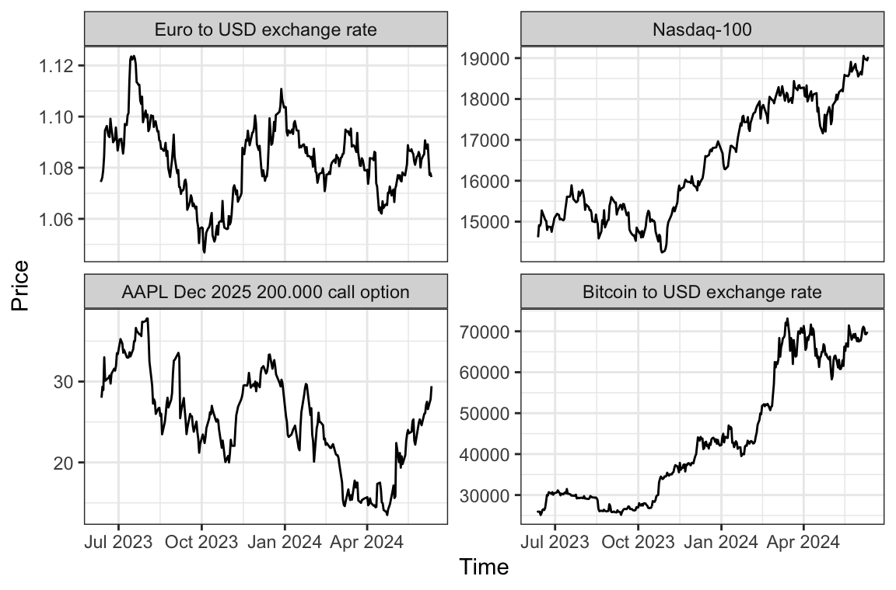

<!-- README.md is generated from README.Rmd. Please edit that file -->

# polygonR

<!-- badges: start -->

[](https://github.com/flynngo/polygonR/actions/workflows/R-CMD-check.yaml)

<!-- badges: end -->

polygonR is an R package that streamlines financial market data analysis
by simplifying the process of querying data and processing data from the
[polygon.io](www.polygon.io) API.

## Installation

You can install the development version of polygonR from
[GitHub](https://github.com/) with:

``` r
# install.packages("devtools")
devtools::install_github("flynngo/polygonR")
```

<!-- We include the getting started vignette in lieu of writing new examples -->

## Setup

``` r
library(polygonR)
library(magrittr)
library(dplyr)
library(ggplot2)
theme_set(theme_bw())
```

Before we can begin querying market data, we need an API key to
authenticate our queries to polygon.io. If you haven’t already, go to
\<www.polygon.io\> and sign up for an account. Any account can request
data, although some types of requests are only available to certain
membership plans and Basic accounts are limited to 5 API calls per
minute.

Once you’re signed in to your account, your API keys can be found from
the dashboard. We can supply it to `polygonR` as follows.

``` r
set_api_key()
```

This will bring up a secure text field where you can input the API key.
The key will be stored as the environment variable `POLYGON_KEY`.
Depending on your RStudio settings, this may or may not be saved between
sessions. Once we’ve set up our API key, we’re ready to start querying
data!

## Querying data

We’ll start by requesting a summary for all stocks that were traded on
major exchanges on the 11th June 2024. This shows us the opening,
closing, maximum and minimum prices over the day, and the volume that
was traded.

``` r
grouped_daily("2024-06-11")
#> # A tibble: 10,519 × 9
#>    ticker  volume volume_weighted  open   close   high     low
#>    <chr>    <dbl>           <dbl> <dbl>   <dbl>  <dbl>   <dbl>
#>  1 ISCG     21157          44.8    44.8  44.9    45.0   44.6  
#>  2 CVLG     29174          48.1    48.3  48.3    48.3   47.8  
#>  3 OZK    1288577          37.9    37.9  38.1    38.2   37.5  
#>  4 TGLS    706413          44.6    45.6  44.7    45.6   44.3  
#>  5 RDVY    760418          54.0    54.3  54.1    54.3   53.8  
#>  6 YYAI     84449           0.768   0.8   0.751   0.81   0.740
#>  7 ALX       8024         209.    210.  209.    210.   209.   
#>  8 IVOO     44055          98.5    98.7  98.8    98.8   97.9  
#>  9 ALCO     14640          25.8    26.2  25.8    26.2   25.7  
#> 10 QFIN   1103423          20.2    20.4  20.1    20.5   20.1  
#> # ℹ 10,509 more rows
#> # ℹ 2 more variables: time <dttm>, transactions <int>
```

We can also request the historical performance of a stock at more
regular intervals, over a longer period of time. Let’s demonstrate this
by plotting Apple’s stock price in minute interval for the last year.

``` r
aapl <- aggregates("AAPL", timespan = "minute", from = "2023-06-11", to = "2024-06-11")
summary(aapl)
#>     ticker              volume         volume_weighted      open      
#>  Length:188667      Min.   :     100   Min.   :159.6   Min.   :164.1  
#>  Class :character   1st Qu.:    1402   1st Qu.:175.1   1st Qu.:175.1  
#>  Mode  :character   Median :   37630   Median :182.9   Median :182.9  
#>                     Mean   :   66151   Mean   :182.6   Mean   :182.6  
#>                     3rd Qu.:   88572   3rd Qu.:190.1   3rd Qu.:190.1  
#>                     Max.   :16723294   Max.   :207.9   Max.   :207.8  
#>      close            high            low       
#>  Min.   :164.1   Min.   :164.2   Min.   :164.1  
#>  1st Qu.:175.1   1st Qu.:175.1   1st Qu.:175.1  
#>  Median :182.9   Median :182.9   Median :182.8  
#>  Mean   :182.6   Mean   :182.7   Mean   :182.6  
#>  3rd Qu.:190.1   3rd Qu.:190.1   3rd Qu.:190.0  
#>  Max.   :207.8   Max.   :207.9   Max.   :207.8  
#>       time                         transactions    
#>  Min.   :2023-06-12 08:00:00.00   Min.   :    1.0  
#>  1st Qu.:2023-09-11 08:03:30.00   1st Qu.:   34.0  
#>  Median :2023-12-12 00:22:00.00   Median :  515.0  
#>  Mean   :2023-12-11 20:42:37.24   Mean   :  857.5  
#>  3rd Qu.:2024-03-13 14:43:30.00   3rd Qu.: 1060.0  
#>  Max.   :2024-06-11 23:59:00.00   Max.   :62925.0
```

``` r
aapl |>
  ggplot(aes(x = time, y = open)) +
  geom_path() +
  labs(x = "Time", y = "Price")
```



We can easily compare the performance of several stocks. Since we’re
only planning to plot our data, we’ll speed up the query time for our
free polygon.io account by increasing the time interval to one day.

``` r
faang <-
  c("META", "AMZN", "AAPL", "NFLX", "GOOG") |>
  lapply(\(.ticker) {
    aggregates(
      .ticker,
      timespan = "day",
      from = "2023-06-11",
      to = "2024-06-11")}) |>
  bind_rows()
faang |>
  filter(time == max(time) | time == min(time))
#> # A tibble: 10 × 9
#>    ticker    volume volume_weighted  open close  high   low time               
#>    <chr>      <dbl>           <dbl> <dbl> <dbl> <dbl> <dbl> <dttm>             
#>  1 META    15471689            269.  267.  271.  272.  265. 2023-06-12 04:00:00
#>  2 META     8897158            504.  500.  507.  508.  498. 2024-06-11 04:00:00
#>  3 AMZN    51473276            126.  124.  127.  127.  124. 2023-06-12 04:00:00
#>  4 AMZN    26638046            186.  187.  187.  188.  185. 2024-06-11 04:00:00
#>  5 AAPL    54754995            183.  181.  184.  184.  181. 2023-06-12 04:00:00
#>  6 AAPL   169677009            203.  194.  207.  207.  194. 2024-06-11 04:00:00
#>  7 NFLX     5967712            421.  419.  424.  425.  417. 2023-06-12 04:00:00
#>  8 NFLX     2131447            646.  641.  649.  650.  641. 2024-06-11 04:00:00
#>  9 GOOG    22289632            124.  123.  124.  125.  122. 2023-06-12 04:00:00
#> 10 GOOG    13169210            177.  178.  178.  178.  175. 2024-06-11 04:00:00
#> # ℹ 1 more variable: transactions <int>
```

The stock price for Meta and Netflix has grown significantly over the
year. However, there are large differences between the starting prices,
so plotting the absolute stock price is not particularly informative.
Let’s rescale the prices of each stock by their price on the first day
in our dataset, which should give us a much better sense of how each
company has grown over this period.

``` r
faang <- faang |>
  group_by(ticker) |>
  mutate(growth = open / open[1] - 1)

faang |>
  ggplot(aes(x = time, y = growth, colour = ticker)) +
  geom_path() +
  labs(x = "Time", y = "Growth (since 2023-06-11)") +
  scale_y_continuous(labels = scales::percent)
```



After rescaling, we can see just how well Meta stock performed. With the
exception of Apple, the remaining FAANG companies all saw similar growth
over the period.

## Querying other markets

So far we’ve only shown queries from major stock exchanges, but Polygon
tracks prices for OTC stocks and market indexes, as well as the forex,
crypto and option markets. We can also query those with `polygonR`.

``` r
other_queries <- 
  c("I:NDX", "C:EURUSD", "X:BTCUSD", "O:AAPL251219C00200000") |>
  lapply(\(.ticker) {
    aggregates(
      .ticker,
      timespan = "day",
      from = "2023-06-11",
      to = "2024-06-11")}) |>
  bind_rows()
facet_labels <- as_labeller(
  c("C:EURUSD" = "Euro to USD exchange rate",
    "I:NDX" = "Nasdaq-100", 
    "O:AAPL251219C00200000" = "AAPL Dec 2025 200.000 call option", 
    "X:BTCUSD" = "Bitcoin to USD exchange rate")
  )
other_queries |>
  ggplot(aes(x = time, y = open)) +
  geom_path() +
  facet_wrap("ticker", ncol = 2, scales = "free_y", labeller = facet_labels) +
  labs(x = "Time", y = "Price")
```



## Further information

For more information about each type of query Look at the package
documentation. `polygonr` has functionality for most queries that can be
made of the polygon.io API ([see
here](https://polygon.io/docs/stocks/getting-started)). Feature requests
and bug reports can be submitted on
[Github](https://github.com/flynngo/polygonR).

<!-- ```{r example} -->
<!-- library(polygonR) -->
<!-- ## basic example code -->
<!-- ``` -->
<!-- What is special about using `README.Rmd` instead of just `README.md`? You can include R chunks like so: -->
<!-- ```{r cars} -->
<!-- summary(cars) -->
<!-- ``` -->
<!-- You'll still need to render `README.Rmd` regularly, to keep `README.md` up-to-date. `devtools::build_readme()` is handy for this. -->
<!-- You can also embed plots, for example: -->
<!-- ```{r pressure, echo = FALSE} -->
<!-- plot(pressure) -->
<!-- ``` -->
<!-- In that case, don't forget to commit and push the resulting figure files, so they display on GitHub and CRAN. -->
